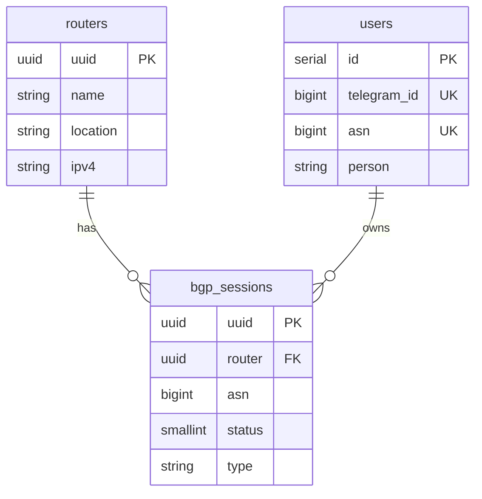

# MoeNet Core Database Schema

## Overview

MoeNet Core uses PostgreSQL with Sequelize ORM. The database stores user information, router configurations, and BGP session data.

## Tables

### users

Stores registered users and their authentication status.

| Column | Type | Description |
| --- | --- | --- |
| id | SERIAL | Primary key |
| telegram_id | BIGINT | Telegram user ID (unique) |
| asn | BIGINT | User's AS number (unique) |
| person | VARCHAR(200) | MNTNER name from WHOIS |
| is_admin | BOOLEAN | Admin privilege flag |
| is_blocked | BOOLEAN | Blocked status |
| created_at | TIMESTAMP | Record creation time |
| updated_at | TIMESTAMP | Last update time |

### routers

Stores MoeNet router/node configurations.

| Column | Type | Description |
| --- | --- | --- |
| uuid | UUID | Primary key |
| name | VARCHAR(100) | Node identifier (e.g., `jp-edge`) |
| location | VARCHAR(200) | Geographic location |
| ipv4 | VARCHAR(50) | Public IPv4 address |
| ipv6 | VARCHAR(100) | Public IPv6 address |
| callback_url | VARCHAR(200) | Agent callback URL |
| created_at | TIMESTAMP | Record creation time |
| updated_at | TIMESTAMP | Last update time |

### bgp_sessions

Stores BGP peering session configurations.

| Column | Type | Description |
| --- | --- | --- |
| uuid | UUID | Primary key |
| router | UUID | Foreign key to routers.uuid |
| asn | BIGINT | Peer's AS number |
| status | SMALLINT | Session status (see below) |
| mtu | INTEGER | Tunnel MTU (default: 1420) |
| policy | VARCHAR(50) | Import policy |
| ipv4 | VARCHAR(50) | Peer's IPv4 address |
| ipv6 | VARCHAR(100) | Peer's IPv6 address |
| ipv6_link_local | VARCHAR(100) | Link-local IPv6 |
| type | VARCHAR(20) | Tunnel type (WIREGUARD, etc.) |
| extensions | JSONB | BGP extensions config |
| interface | VARCHAR(50) | WireGuard interface name |
| endpoint | VARCHAR(100) | Peer's WireGuard endpoint |
| credential | JSONB | Tunnel credentials (public key, etc.) |
| data | JSONB | Additional session data |
| last_error | TEXT | Last error message |
| created_at | TIMESTAMP | Record creation time |
| updated_at | TIMESTAMP | Last update time |

#### Session Status Codes

| Code | Name | Description |
| --- | --- | --- |
| 0 | DISABLED | Session disabled |
| 1 | ACTIVE | Session active and running |
| 2 | ERROR | Session has errors |
| 3 | PENDING_REVIEW | Awaiting admin approval |
| 4 | QUEUED_FOR_SETUP | Approved, waiting for agent |
| 5 | QUEUED_FOR_DELETE | Marked for deletion |
| 6 | SETUP_FAILED | Agent setup failed |

### settings

Key-value store for system settings.

| Column | Type | Description |
| --- | --- | --- |
| key | VARCHAR(100) | Setting key (primary key) |
| value | TEXT | Setting value |
| created_at | TIMESTAMP | Record creation time |
| updated_at | TIMESTAMP | Last update time |

## Relationships

## Migration from Legacy Schema

The legacy Python control plane used different table names:

| Legacy Table | New Table | Notes |
| --- | --- | --- |
| nodes | routers | Same structure |
| peers | bgp_sessions | Status codes changed |
| telegram_users | users | Added is_blocked field |
| blocked_asns | (settings) | Stored as JSON in settings |
| approvals | (removed) | Approval history in bgp_sessions |

## Indexes

- `users.telegram_id` - Unique index for Telegram login
- `users.asn` - Unique index for ASN lookup
- `bgp_sessions.router` - Foreign key index
- `bgp_sessions.asn` - Lookup by peer ASN
- `bgp_sessions.status` - Filter by status
