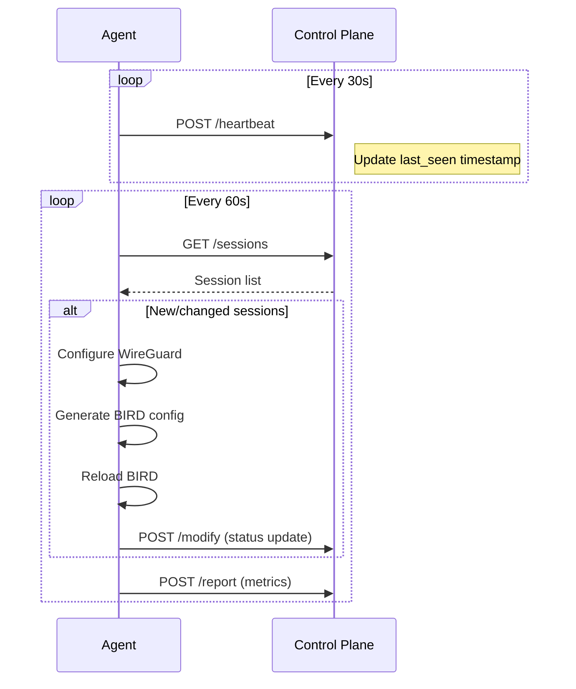

# Agent Protocol

**Base URL:** `https://api.moenet.work`

The Agent API is used by `moenet-agent` instances running on each node to communicate with the Control Plane.

## Authentication

Agent endpoints use a per-node API token:

```bash
Authorization: Bearer <agent-token>
```

## Endpoints

### GET /agent/:router/sessions

Fetch all BGP sessions assigned to this node.

```bash
curl -H "Authorization: Bearer $AGENT_TOKEN" \
  https://api.moenet.work/agent/jp1/sessions
```

The agent polls this endpoint periodically (default: 60s) and applies any pending changes.

### GET /agent/:router/bird-config

Fetch BIRD policy and community configuration for this node.

```bash
curl -H "Authorization: Bearer $AGENT_TOKEN" \
  https://api.moenet.work/agent/jp1/bird-config
```

### GET /agent/:router/mesh

Fetch mesh IGP peer list for WireGuard mesh setup.

```bash
curl -H "Authorization: Bearer $AGENT_TOKEN" \
  https://api.moenet.work/agent/jp1/mesh
```

### GET /agent/:router/config

Fetch full bootstrap configuration (used on first startup).

```bash
curl -H "Authorization: Bearer $AGENT_TOKEN" \
  https://api.moenet.work/agent/jp1/config
```

### POST /agent/:router/heartbeat

Report agent health status.

```bash
curl -X POST https://api.moenet.work/agent/jp1/heartbeat \
  -H "Authorization: Bearer $AGENT_TOKEN" \
  -H "Content-Type: application/json" \
  -d '{
    "version": "2.0.0",
    "uptime": 3600,
    "meshPublicKey": "..."
  }'
```

### POST /agent/:router/report

Report session metrics (RTT, route counts, traffic stats).

```bash
curl -X POST https://api.moenet.work/agent/jp1/report \
  -H "Authorization: Bearer $AGENT_TOKEN" \
  -H "Content-Type: application/json" \
  -d '{
    "sessions": [
      {
        "uuid": "session-uuid",
        "rtt": 12.5,
        "rxBytes": 1024000,
        "txBytes": 512000,
        "routesImported": 42
      }
    ]
  }'
```

### POST /agent/:router/modify

Update session status after configuration changes.

```bash
curl -X POST https://api.moenet.work/agent/jp1/modify \
  -H "Authorization: Bearer $AGENT_TOKEN" \
  -H "Content-Type: application/json" \
  -d '{
    "uuid": "session-uuid",
    "status": 1,
    "interface": "wg_24001"
  }'
```

### POST /agent/:router/mesh/status

Report mesh peer status.

## Communication Flow



## Health & Metrics

### GET /health

```bash
curl https://api.moenet.work/health
# {"status": "ok"}
```

### GET /metrics

Returns Prometheus-format metrics.

```bash
curl https://api.moenet.work/metrics
```

## Rate Limits

| Route | Limit |
|-------|-------|
| `/agent/*` | 300 requests/min |
