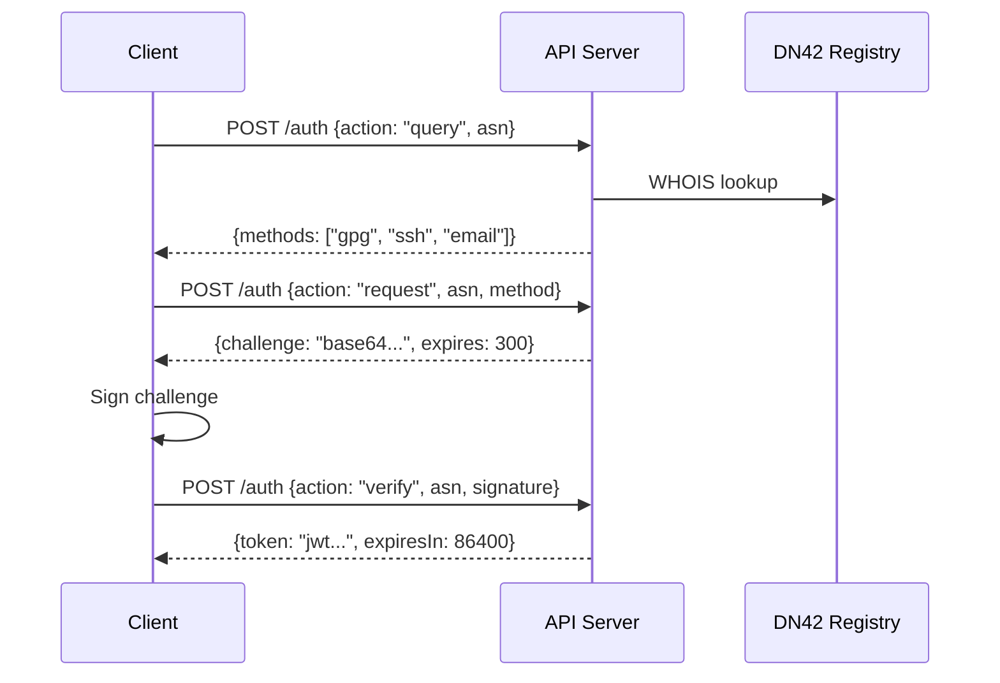

# Authentication

**Base URL:** `https://api.moenet.work`

MoeNet supports three authentication methods against the DN42 registry: GPG, SSH, and Email.

## Authentication Flow



## Endpoints

### Query User Info

Check if an ASN is registered and available authentication methods.

```bash
curl -X POST https://api.moenet.work/auth \
  -H "Content-Type: application/json" \
  -d '{"action": "query", "asn": 4242421080}'
```

**Response:**

```json
{
  "exists": true,
  "mntner": "EXAMPLE-MNT",
  "methods": ["gpg", "ssh", "email"]
}
```

### Request Challenge

```bash
curl -X POST https://api.moenet.work/auth \
  -H "Content-Type: application/json" \
  -d '{"action": "request", "asn": 4242421080, "method": "gpg"}'
```

**Response:**

```json
{
  "challenge": "base64-encoded-challenge",
  "expires": 300
}
```

### Verify Challenge

Submit signed challenge to receive JWT token.

```bash
curl -X POST https://api.moenet.work/auth \
  -H "Content-Type: application/json" \
  -d '{
    "action": "verify",
    "asn": 4242421080,
    "method": "gpg",
    "signature": "base64-encoded-signature"
  }'
```

**Response:**

```json
{
  "token": "eyJhbGciOiJIUzI1NiIs...",
  "expiresIn": 86400
}
```

## Using the Token

All authenticated endpoints require the JWT token in the `Authorization` header:

```bash
Authorization: Bearer <jwt-token>
```

## Error Codes

| Code | Description |
|------|-------------|
| `AUTH_FAILED` | Signature verification failed |
| `INVALID_TOKEN` | JWT token invalid or expired |
| `ASN_BLOCKED` | ASN has been blocked by admin |
| `ASN_NOT_FOUND` | ASN not found in DN42 registry |

## Rate Limits

| Route | Limit |
|-------|-------|
| `/auth` | 60 requests/min |
