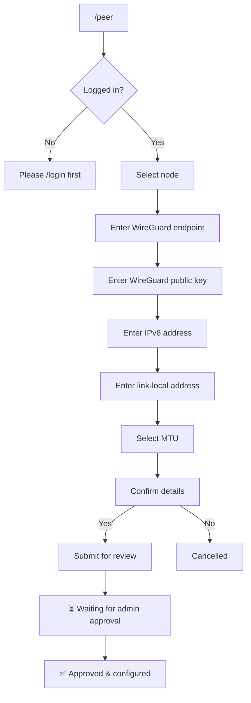

# Bot Commands

The MoeNet DN42 Bot ([@moenet_dn42_bot](https://t.me/moenet_dn42_bot)) provides a bilingual (EN/ZH) interface for peering management.

## User Commands

| Command | Description |
|---------|-------------|
| `/start`, `/help` | Show all available commands |
| `/login <ASN>` | Login with your DN42 AS number |
| `/logout` | End current session |
| `/whoami` | Show current login status |
| `/cancel` | Cancel current operation |

## Peering Commands

Requires login (`/login` first).

| Command | Description |
|---------|-------------|
| `/peer` | Create new peer (guided wizard) |
| `/info` | View your current peers |
| `/modify` | Modify peer settings (endpoint, MTU) |
| `/remove` | Delete a peer |
| `/status` | Check WireGuard & BGP status |
| `/restart` | Restart WireGuard tunnel |

## Network Tools

Available to all users without login.

| Command | Description |
|---------|-------------|
| `/ping <target>` | Ping from MoeNet nodes |
| `/trace <target>` | Traceroute from nodes |
| `/whois <query>` | DN42 WHOIS lookup |
| `/dig <domain>` | DNS lookup |
| `/route <prefix>` | BGP route lookup |
| `/findnoc <asn>` | Find NOC contact info |

## Admin Commands

Requires admin privileges.

| Command | Description |
|---------|-------------|
| `/addnode` | Add new node (wizard) |
| `/bootstrap <node>` | Generate bootstrap script |
| `/delnode <node>` | Delete a node |
| `/nodes` | List all nodes |
| `/pending` | List pending peer requests |
| `/block <ASN>` | Block an ASN |
| `/main` | Toggle maintenance mode |

## Status & Metrics

| Command | Description |
|---------|-------------|
| `/stats` | Network statistics |
| `/rank` | Node ranking by metrics |
| `/community` | BGP community reference |
| `/latency` | Inter-node latency matrix |

## Peer Creation Flow

