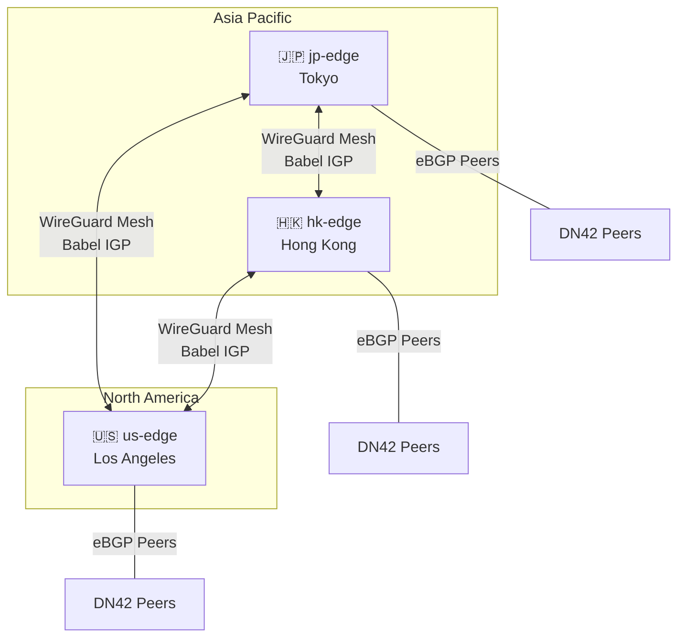
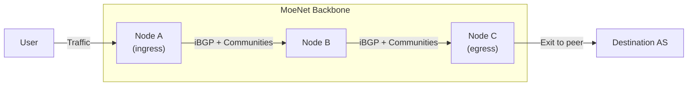
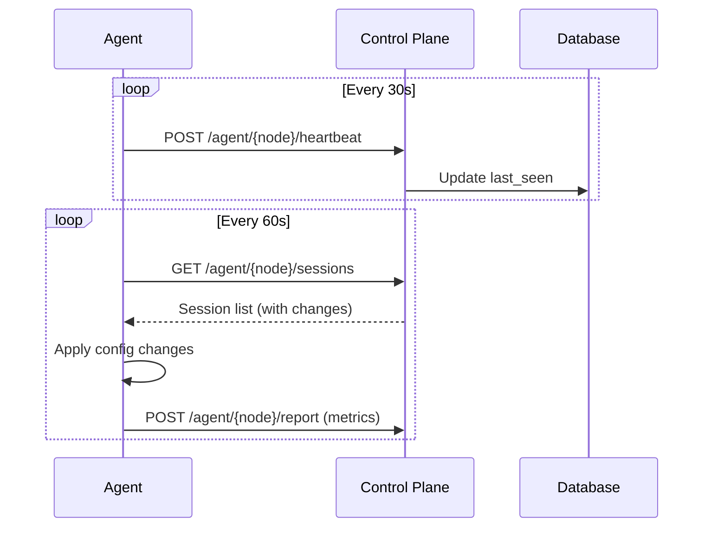

# Network Topology

## Physical Topology

MoeNet nodes are deployed across multiple regions, connected via a full-mesh WireGuard underlay.

## Routing Architecture

### BGP Design

| Type | Protocol | Purpose |
|------|----------|---------|
| **eBGP** | BGP4 + MP-BGP | External peering with DN42 participants |
| **iBGP** | BGP4 + MP-BGP | Route distribution between MoeNet nodes |
| **IGP** | Babel (via BIRD 3) | Internal reachability over WireGuard mesh |

### Cold Potato Routing

MoeNet uses **Large Communities** to implement cold potato routing — keeping traffic inside the backbone as long as possible before egressing at the nearest node to the destination.

Communities encode the ingress point, allowing the BGP decision process to prefer the exit node closest to the destination.

## WireGuard Mesh

Each node pair has a dedicated WireGuard tunnel for the IGP mesh:

| Parameter | Value |
|-----------|-------|
| Interface prefix | `mesh_` |
| Listen port | `23456` |
| Keepalive | `25s` |
| MTU | `1420` |
| Routing protocol | Babel |

### Address Allocation

Each node is assigned a unique ID (1–62) used to derive:

- **Loopback IPv4**: `172.23.105.{176 + nodeId}`
- **Loopback IPv6**: `fd48:4242:420::{nodeId}`
- **Mesh link-local**: `fe80::998:{nodeId}`

## Control Plane Communication

## DNS & Domains

| Domain | Service |
|--------|---------|
| `api.moenet.work` | Control Plane API |
| `bot.moenet.work` | Telegram Bot webhook |
| `docs.moenet.work` | Documentation (this site) |
| `*.moenet.work` | Node-specific endpoints |
