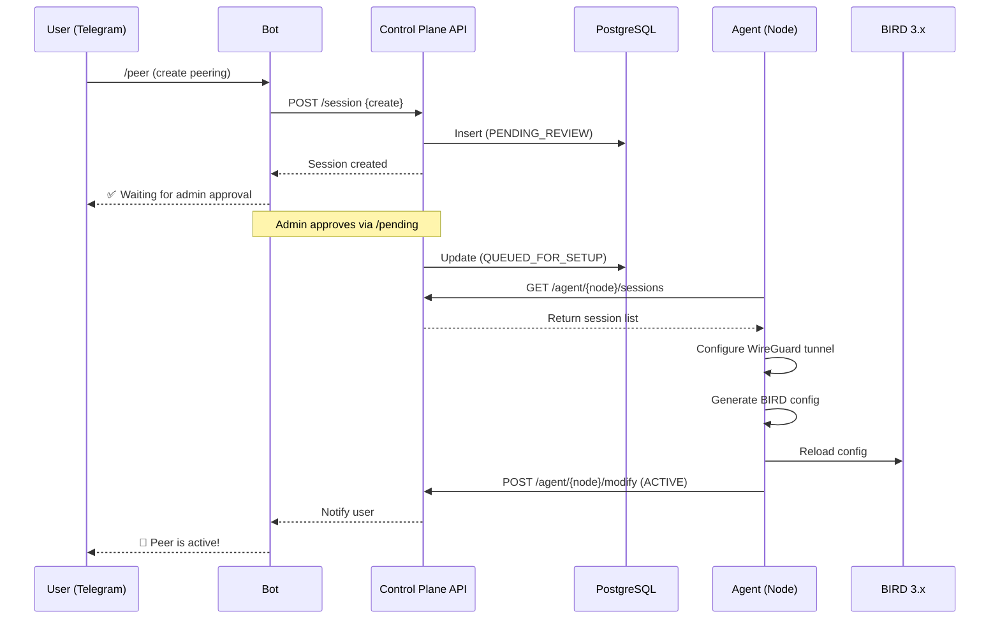

# Overview

MoeNet DN42 is an automated BGP peering platform on the [DN42](https://dn42.dev) network. It consists of two main components:

## System Components

| Component | Repository | Technology | Role |
|-----------|-----------|------------|------|
| **MoeNet Core** | [moenet-core](https://github.com/heichaowo/moenet-core) | Bun, TypeScript, Hono, grammY | Control Plane — API, Telegram Bot, policy storage |
| **MoeNet Agent** | [moenet-agent](https://github.com/heichaowo/moenet-agent) | Go 1.26, BIRD 3.x | Node agent — WireGuard/BIRD config, metrics, mesh |

## How It Works

## Architecture Philosophy

> Infrastructure initializes, Control Plane stores intent, Agent executes reality.

| Layer | Responsibility |
|-------|---------------|
| **Intent (Core)** | API, Bot, policy storage, config distribution |
| **Execution (Agent)** | Template rendering, WireGuard/BIRD management, metrics reporting |
| **Infrastructure** | System setup (BIRD/WG install, sysctl, firewall) — emergency recovery only |

## Technology Stack

### Control Plane (moenet-core)

| Technology | Version | Purpose |
|-----------|---------|---------|
| Bun | Latest | Runtime and package manager |
| TypeScript | 5.9.3 | Type-safe JavaScript |
| Hono | 4.6.0 | Web framework |
| grammY | 1.21.0 | Telegram Bot framework |
| Sequelize | 6.37.0 | PostgreSQL ORM |
| Zod | 4.3.6 | Schema validation |
| PostgreSQL | 16 | Persistent storage |
| Redis | ioredis 5.4.x | Session/cache storage |

### Agent (moenet-agent)

| Technology | Version | Purpose |
|-----------|---------|---------|
| Go | 1.26.4 | Runtime |
| BIRD | 3.x | BGP routing daemon |
| WireGuard | Kernel | VPN tunnel |

## Key Features

- **Automated BGP Session Management** — Full lifecycle from creation to teardown
- **Multi-auth** — GPG, SSH, or Email verification against DN42 registry
- **P2P Mesh IGP** — WireGuard underlay with Babel for internal routing
- **Cold Potato Routing** — Keep traffic inside backbone via Large Communities
- **Node Bootstrap** — One-command agent deployment
- **Bilingual** — English and Chinese interface
- **Real-time Metrics** — RTT, route statistics, traffic monitoring

::: tip Deep Dive into Code
For detailed code-level documentation (module structure, call chains, internal implementation), see the auto-generated docs on DeepWiki:
- [moenet-core on DeepWiki](https://deepwiki.com/heichaowo/moenet-core)
- [moenet-agent on DeepWiki](https://deepwiki.com/heichaowo/moenet-agent)
:::
