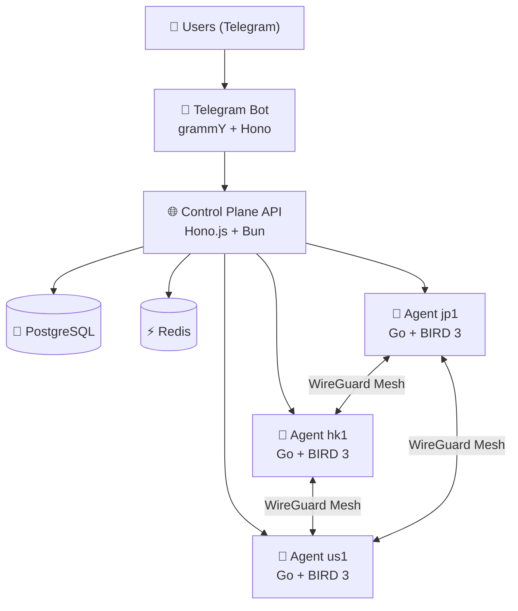

## Architecture

```mermaid
graph TB
    Users["👤 Users (Telegram)"] --> Bot["🤖 Telegram Bot<br/>grammY + Hono"]
    Bot --> API["🌐 Control Plane API<br/>Hono.js + Bun"]
    API --> PG[("🐘 PostgreSQL")]
    API --> Redis[("⚡ Redis")]
    API --> Agent1["📡 Agent jp1<br/>Go + BIRD 3"]
    API --> Agent2["📡 Agent hk1<br/>Go + BIRD 3"]
    API --> Agent3["📡 Agent us1<br/>Go + BIRD 3"]
    Agent1 <--> |"WireGuard Mesh"| Agent2
    Agent2 <--> |"WireGuard Mesh"| Agent3
    Agent1 <--> |"WireGuard Mesh"| Agent3
```
